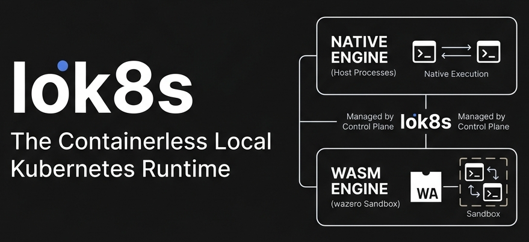
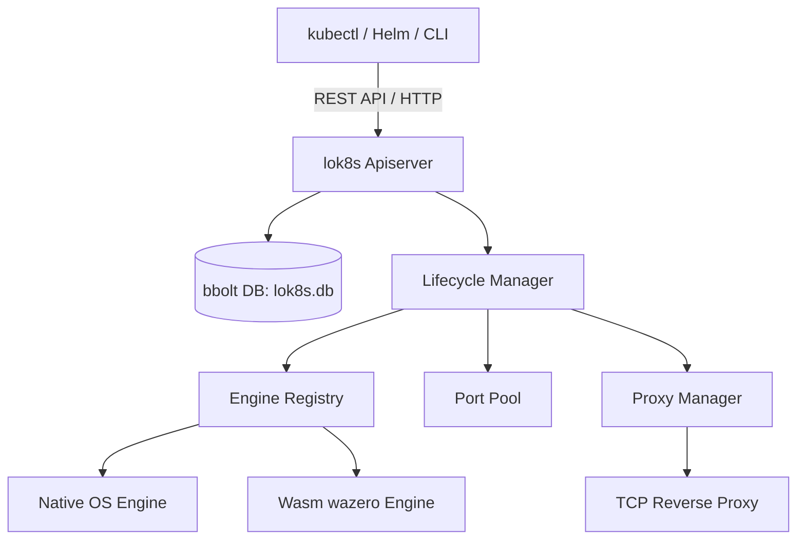

<p align="center">
  
</p>

<p align="center">
  <a href="https://pkg.go.dev/github.com/megawron/lok8s"></a>
  <a href="https://goreportcard.com/report/github.com/megawron/lok8s"></a>
  <a href="https://github.com/megawron/lok8s/actions/workflows/ci.yml"></a>
  <a href="https://opensource.org/licenses/MIT"></a>
</p>

**The Containerless Local Kubernetes Runtime.**

Tired of waiting for docker build and local registry image pushes just to test a single code change? 

lok8s (pronounced Local-K8s) lets you deploy your unmodified production Kubernetes manifests locally in sub-milliseconds by running them as native host processes or sandboxed WebAssembly (Wasm) modules.

---

## The Dev-Loop Comparison

| Metric | lok8s | Minikube / Kind | Docker Desktop (K8s) |
| :--- | :---: | :---: | :---: |
| **Orchestrator Boot Time** | **~5 ms** | 1 – 3 minutes | 3 – 5 minutes |
| **Pod Creation Latency** | **~2 ms** | 2 – 5 seconds | 3 – 10 seconds |
| **45-Pod Scaling Stress Test** | **0.68 seconds** | 30 – 90 seconds | 1 – 2 minutes |
| **Memory Footprint (Idle)** | **~25 MB** | ~2.5 GB | ~3.5 GB |
| **CPU Overhead (Idle)** | **0%** | 5 – 15% | 10 – 25% |
| **Offline Capability** | **100% Offline** | Needs registry/pulls | Needs registry/pulls |

---

## Perfect Use Cases

`lok8s` is designed to be the ultimate companion for specific, high-friction stages of Kubernetes development:

1. **⚡ Rapid Microservice Prototyping (Sub-Second Iteration)**
   * **The Pain:** You edit one line of code, then wait 30–60 seconds for `docker build`, local registry push, image pull, and container boot.
   * **The Solution:** Press save, compile natively (e.g. `go build` or `cargo build`), and `lok8s` starts or restarts the pod in **under 2 milliseconds**. The loop is as fast as modern frontend hot-reloads.
2. **🐛 Direct IDE Debugging (Breakpoints & Step-Through)**
   * **The Pain:** Debugging code running inside containers is complex, requiring exposed debugger ports, SSH tunnels, or custom images.
   * **The Solution:** Because `lok8s` runs pods as native processes on your host, you can attach your IDE debugger (VS Code, GoLand, IntelliJ, etc.) directly to the running process for instant breakpoints.
3. **🔋 Battery & Resource Preservation (Silent Dev)**
   * **The Pain:** Running Minikube or Docker Desktop drains 2–4 GB of RAM and 15% CPU on idle, generating laptop fan noise and draining your battery in 1–2 hours.
   * **The Solution:** `lok8s` uses **25 MB RAM and 0% CPU** on idle. Develop completely offline on a train or plane in absolute silence.
4. **🧪 Instant Integration Testing (Sub-Second CI/CD Pipelines)**
   * **The Pain:** Integration test pipelines wait 2–3 minutes just for a local Kind or Minikube cluster to boot up in GitHub Actions or GitLab CI.
   * **The Solution:** `lok8s` starts in **5 milliseconds**. Run full integration tests against the Kubernetes API instantly, saving developer time and runner costs.

---

## How it Works & Trade-offs (The Honest Truth)

`lok8s` achieves sub-millisecond startup and near-zero overhead by completely bypassing container daemons, image builds, and virtual machines. 

### How Workloads are Resolved
When you apply a Pod manifest, `lok8s` intercepts the container `image` name (e.g., `image: my-service:v1.2.0`), strips the registry/tag details to get the base name (`my-service`), and searches for a matching local executable binary or WebAssembly module on your host system:
1. **Current Working Directory** (e.g., `./my-service` or `./my-service.exe`)
2. **Local Bin Directory** (e.g., `./bin/my-service`)
3. **System PATH** (directories defined in your system's environment `PATH`)

### Integrating with your Dev Flow (No manual copying required)
You do not need to manually drag-and-drop binaries. Instead, simply configure your existing build tool's compiler output to target the `./bin/` folder or run compile-in-place commands:
* **Go:** `go build -o ./bin/my-service`
* **Rust:** `cargo build --target-dir ./bin`
* **C++ / Make:** `make && cp my-service ./bin/`

### The Limitations & Trade-offs
* **No Automatic Registry Pulls:** Since there is no container runtime, `lok8s` cannot pull and run arbitrary Docker images from registries.
* **Third-Party Services (e.g., Postgres, Redis):** To run standard off-the-shelf databases or external services in your manifest, the corresponding binary (e.g., `postgres` or `redis-server`) **must be installed on your host system** and present in your `PATH` (e.g., via `brew install redis`, `apt install redis`, or `choco install redis`).
* **Shared Network Namespace:** All processes run directly on your host loopback interface with no network namespace isolation. If your pods define container ports, `lok8s` intercepts them and allocates a unique local host port (which is dynamically assigned and injected via the `LOK8S_PORT` environment variable).

---

## Quick Start

### 1. Build and Start the Daemon
```bash
git clone https://github.com/megawron/lok8s.git
cd lok8s
go build -o lok8s main.go
./lok8s start
```

### 2. Configure kubectl
Point your standard `kubectl` to your local `lok8s` instance:
```bash
kubectl config set-cluster lok8s --server=http://localhost:8080
kubectl config set-context lok8s --cluster=lok8s --namespace=default
kubectl config use-context lok8s
```

### 3. Apply Unmodified Production YAMLs
Apply your standard manifests. lok8s will automatically map the image name to your local binary:

```yaml
apiVersion: v1
kind: Pod
metadata:
  name: my-fast-backend
spec:
  containers:
  - name: app
    image: my-go-service:v1.0.0
    env:
    - name: DB_HOST
      value: "localhost:5432"
```

```bash
kubectl apply -f pod.yaml
```

---

## Production Parity & Zero-Change Migration

`lok8s` is designed with zero vendor lock-in. You do not need to modify your production manifests, use custom Kubernetes resource types, or write proprietary configurations.

### 1. Migrating to lok8s (Local Dev)
1. **Start the daemon:** Run `./lok8s start` to spin up the mock control plane.
2. **Redirect kubectl:** Configure your context to point local commands to `lok8s`:
   ```bash
   kubectl config set-cluster lok8s --server=http://localhost:8080
   kubectl config use-context lok8s
   ```
3. **Build your code locally:** Output your compiled binary to `./bin/` (e.g. `go build -o ./bin/my-service` or `cargo build --target-dir ./bin`).
4. **Apply unmodified YAMLs:** Run `kubectl apply -f your-manifest.yaml`. `lok8s` intercepts the container image name and maps it directly to your local binary.

### 2. Deploying to Production (GKE, EKS, AKS)
When you are ready to ship to production, you do not need to rewrite, adapt, or clean up your manifests:
1. **Switch context:** Point `kubectl` back to your production or staging cluster:
   ```bash
   kubectl config use-context prod-cluster
   ```
2. **Apply same YAMLs:** Apply the exact same manifest files:
   ```bash
   kubectl apply -f your-manifest.yaml
   ```
   *In production, Kubernetes pulls the standard container images from your container registry. Locally, `lok8s` executes your local binary natively. There is zero translation overhead or configuration mismatch.*

---

## Features

- **Sub-Millisecond Startup:** No image building, no image pulling, no container-daemon handshakes. Your code runs instantly.
- **100% K8s API Compatible:** Use your existing tools. `kubectl`, `helm`, and `kustomize` work out-of-the-box.
- **Smart Localhost Routing:** Intercepts K8s services, spins up TCP reverse-proxies, and dynamically load-balances traffic across active processes using round-robin.
- **Multi-Pod Colorized Log-Streaming:** Run `kubectl logs -l app=web --follow` and see logs from all pods streamed concurrently, prefix-colored per pod.
- **State Recovery & Persistence:** Persists state via a local `bbolt` database. Restarts recover all pods, ports, and services automatically.
- **Dual-Engine Isolation:** Run native OS binaries (`os/exec`) or secure, sandboxed WebAssembly bytecode inside an embedded CGO-free [wazero](https://wazero.io/) runtime.

---

## Architecture



## Contributing

We welcome pull requests!

1. Fork the repo
2. Create your feature branch (`git checkout -b feature/AmazingFeature`)
3. Commit your changes (`git commit -m 'Add some AmazingFeature'`)
4. Push to the branch (`git push origin feature/AmazingFeature`)
5. Open a Pull Request

## License

Distributed under the MIT License. See `LICENSE` for more information.
