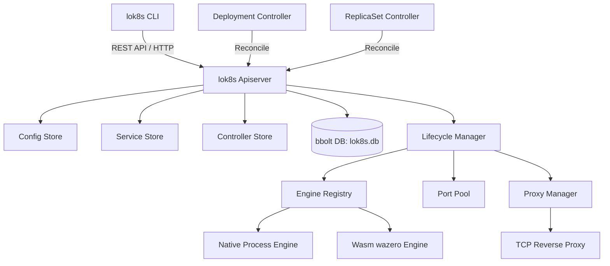

# lok8s — Lightweight Pod Supervisor (No Containers Required)

lok8s is a lightweight, single-binary Kubernetes-compatible orchestrator designed to run processes directly on host machines as "Pods" without requiring Docker, containerd, or VMs. It executes native binaries and WebAssembly (Wasm) modules, providing Kubernetes-style resource management, volume projection, health probes, service networking, and rolling deployments.

---

## Capabilities and Use Cases

lok8s is built for lightweight, container-free orchestration. Key use cases include:

- **Local Microservice Development**: A fast, low-overhead alternative to Minikube or Docker Desktop for running multi-service setups with service discovery, configurations, and rolling updates.
- **CI/CD and High-Speed Integration Testing**: Running automated orchestration and multi-process tests in sandboxed pipelines without the startup latency or footprint of spawning VM environments or Docker daemons.
- **Single-Machine Desktop Application Suites**: Bundling and running local application suites (e.g. desktop software composed of separate frontend, backend, and daemon processes) under a unified supervisor without forcing the client to install Docker.
- **Legacy Bare-Metal Orchestration**: Providing automated rollouts, scaling, and load-balancing for traditional applications without virtualization layers.
- **Wasm Serverless Workloads**: Running sandboxed WebAssembly plug-ins or microservices using the embedded [wazero](https://github.com/tetratelabs/wazero) runtime.

---

## Limitations and Target Runtimes

Because lok8s does not use container virtualization (like Docker/containerd) or Linux namespaces for filesystem isolation, the choice of runtime impacts portability and system requirements:

### 1. Native Executable Engine
The native engine runs executables directly as host processes using system calls:
- **Compiled Languages (Go, Rust, C/C++, Zig)**: Highly suited. These compile to standalone, self-contained binaries, requiring no dependencies on the host OS. They start instantly and have zero runtime dependencies.
- **Interpreted Languages (Python, Node.js, Ruby)**: Supported only if the corresponding runtime interpreter is installed on the host system. The manifest must declare the interpreter path (e.g. `/usr/bin/python3` or `node`) and pass the scripts as arguments.
- **OS Portability**: Manifests are OS-dependent. A manifest targeting `/usr/bin/echo` will fail on Windows, and a Windows `.exe` will not run on Linux.

### 2. WebAssembly Engine ([wazero](https://github.com/tetratelabs/wazero))
The WebAssembly engine runs compiled `.wasm` bytecode inside an embedded sandbox:
- **Supported Languages**: The application must be compiled to WebAssembly with WASI support (standard for Rust, Go/TinyGo, C/C++).
- **Portability**: Wasm modules are fully cross-platform and will run identically on Windows, Linux, and macOS without changes to the manifest.
- **Sandbox Restrictions**: Access to the host system is strictly isolated. Workloads can only interact with files projected via volume mounts and network ports allocated by the controller.

---

## Architecture Overview



1. **REST Apiserver**: Provides a subset of the Kubernetes v1 API (`/api/v1`) and apps/v1 API (`/apis/apps/v1`) supporting table output representations (`Accept: as=Table`) for CLI compatibility.
2. **Engine Registry**: Detects manifest annotations and executes native processes or sandboxed Wasm modules.
3. **Port Pool**: Manages TCP port allocations dynamically for pod hostPorts and service nodePorts.
4. **Proxy Manager**: Spins up TCP reverse-proxies to load-balance incoming service requests using a round-robin algorithm across healthy pods.
5. **Controllers**: Background workers executing reconciliation loops to scale ReplicaSets and orchestrate Deployment rollouts.
6. **State Database**: A local [bbolt](https://github.com/etcd-io/bbolt) instance that records resources synchronously. Upon startup, the server automatically recovers from the database, pre-allocates ports, rebuilds service proxies, and relaunches running processes.

---

## Getting Started

### 1. Compile the Binary
Build the single unified `lok8s` binary:
```bash
go build -o lok8s main.go
```

### 2. Run the Apiserver
Start the pod supervisor apiserver daemon (defaults to port `:8080`):
```bash
./lok8s server --addr :8080
```
This initializes the database file `lok8s.db` in the workspace directory.

### 3. Use the CLI Client
Use the same binary to interact with the server (by default, it targets `http://localhost:8080`):
```bash
# Get all pods
./lok8s get pods

# Specify a target server address and namespace
./lok8s -s http://localhost:8080 -n default get deployments
```

---

## CLI Commands Reference

- **`apply -f <path.yaml>`**: Submits a resource manifest. Supports multi-document YAML files separated by `---`.
- **`get <resource> [name]`**: Lists resources in tabular format or prints the JSON representation if a specific name is provided. Resource shorthand names are supported (e.g. `po`, `svc`, `cm`, `rs`, `deploy`).
- **`delete <resource> <name>`**: Deletes a resource and stops associated processes.
- **`logs [pod-name] [flags]`**: Streams logs. Supports single pod streaming, or multiple pod streaming via selectors. Flags include:
  - `-f, --follow`: Stream logs continuously.
  - `-l, --selector <selector>`: Stream logs from all pods matching the label selector (concurrently, color-coded).
  - `--all`: Stream logs from all pods in the namespace (concurrently, color-coded).
  - `--tail <count>`: Limit log output to the last `N` lines.

---

## Resource Manifest Examples

### Native Pod Manifest (`pod.yaml`)
Runs a local binary (e.g., `echo`) with custom arguments:
```yaml
apiVersion: v1
kind: Pod
metadata:
  name: native-echo
  namespace: default
  annotations:
    lok8s.io/engine: "native"
    lok8s.io/executable-path: "echo"
spec:
  containers:
  - name: main
    args:
    - "Hello from lok8s!"
```

### WebAssembly Pod Manifest (`wasm-pod.yaml`)
Runs a Wasm module (e.g., compiled from Rust or Go) using the built-in [wazero](https://github.com/tetratelabs/wazero) runtime:
```yaml
apiVersion: v1
kind: Pod
metadata:
  name: wasm-app
  namespace: default
  annotations:
    lok8s.io/engine: "wasm"
    lok8s.io/executable-path: "path/to/app.wasm"
spec:
  containers:
  - name: app
```

### ConfigMap & Secrets (Volume Projection)
ConfigMaps and Secrets can be projected as files inside the pod environment:
```yaml
apiVersion: v1
kind: ConfigMap
metadata:
  name: app-config
data:
  config.json: '{"debug": true}'
---
apiVersion: v1
kind: Pod
metadata:
  name: config-pod
  annotations:
    lok8s.io/engine: "native"
    lok8s.io/executable-path: "app-binary"
spec:
  volumes:
  - name: cfg-vol
    configMap:
      name: app-config
  containers:
  - name: main
    volumeMounts:
    - name: cfg-vol
      mountPath: "./config"
```

### Service Manifest (`service.yaml`)
Registers a service and spins up a reverse-proxy routing to pods matching the labels:
```yaml
apiVersion: v1
kind: Service
metadata:
  name: web-service
spec:
  ports:
  - port: 8080 # Proxy port on host
  selector:
    app: web
```

### Deployment Manifest (`deployment.yaml`)
Maintains a set of replicated pods with automated rolling updates:
```yaml
apiVersion: apps/v1
kind: Deployment
metadata:
  name: web-deployment
spec:
  replicas: 3
  selector:
    matchLabels:
      app: web
  template:
    metadata:
      labels:
        app: web
      annotations:
        lok8s.io/engine: "native"
        lok8s.io/executable-path: "python"
    spec:
      containers:
      - name: server
        args: ["-m", "http.server", "80"]
        ports:
        - containerPort: 80
```
