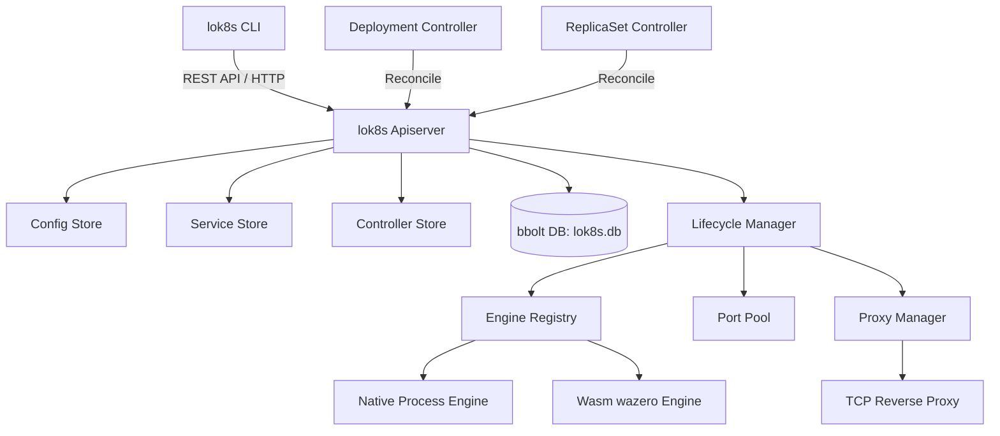

# lok8s — Lightweight Pod Supervisor (No Containers Required)

`lok8s` is a lightweight, single-binary Kubernetes-compatible orchestrator designed to run processes directly on host machines as "Pods" without requiring Docker, containerd, or VMs. It executes native binaries and WebAssembly (Wasm) modules, providing Kubernetes-style resource management, volume projection, health probes, service networking, and rolling deployments.

---

## Key Features

- 🚀 **Zero Container Overhead**: Run native executables and Wasm modules directly on the host OS.
- 📦 **Wasm Support**: Sandboxed execution of WebAssembly modules via the embedded [wazero](https://wazero.io) runtime.
- 📡 **Service Networking & Discovery**: Automatic node port allocation, service environment variables, and built-in Layer-4 Round-Robin TCP reverse-proxy.
- 📁 **Volume Projection**: Mount ConfigMaps and Secrets as temporary file directories inside pod workspaces.
- 🔄 **Reconciliation Loops**: ReplicaSets and Deployments with native Rolling Update support (maxSurge / maxUnavailable logic).
- 🏥 **Lifecycle & Health Probes**: Init-containers, restart policies (`Always`, `OnFailure`, `Never`), and configurable HTTP/TCP health probes.
- 📜 **Log Streaming**: SSE-based streaming logs with support for follow (`-f`) and tail line limits.
- 💾 **Local Persistence**: Full state recovery across restarts backed by a local `bbolt` database file (`lok8s.db`).
- 💻 **CLI Client**: A CLI tool (`lok8s`) mimicking standard `kubectl` behaviors.

---

## Architecture Overview



1. **REST Apiserver**: Provides a subset of the Kubernetes v1 API (`/api/v1`) and apps/v1 API (`/apis/apps/v1`) supporting table output representations (`Accept: as=Table`) for CLI compatibility.
2. **Engine Registry**: Detects manifest annotations and executes native processes or sandboxed Wasm modules.
3. **Port Pool**: Manages TCP port allocations dynamically for pod hostPorts and service nodePorts.
4. **Proxy Manager**: Spins up TCP reverse-proxies to load-balance incoming service requests using a round-robin algorithm across healthy pods.
5. **Controllers**: Background workers executing reconciliation loops to scale ReplicaSets and orchestrate Deployment rollouts.
6. **State Database**: A local `go.etcd.io/bbolt` instance that records resources synchronously. Upon startup, the server automatically recovers from the database, pre-allocates ports, rebuilds service proxies, and relaunches running processes.

---

## Getting Started

### 1. Build and Run the Apiserver
Run the orchestrator apiserver on a chosen port (defaults to `:8080`):
```bash
go run main.go -addr :8080
```
This initializes the database file `lok8s.db` in the workspace directory.

### 2. Compile and Use the CLI Client
You can build the CLI client:
```bash
go build -o lok8s cmd/lok8s/main.go
```

Use the client to query resources (by default, it targets `http://localhost:8080`):
```bash
# Get all pods
./lok8s get pods

# Specify a target server address and namespace
./lok8s -s http://localhost:8080 -n default get deployments
```

---

## CLI Commands Reference

- **`apply -f <path.yaml>`**: Submits a resource manifest. Supports multi-document YAML files separated by `---`.
- **`get <resource> [name]`**: Lists resources in tabular format or prints the JSON representation if a specific name is provided. Resource shorthand names are supported (e.g. `po`, `svc`, `cm`, `rs`, `deploy`).
- **`delete <resource> <name>`**: Deletes a resource and stops associated processes.
- **`logs <pod-name> [flags]`**: Streams logs. Flags include:
  - `-f, --follow`: Stream logs continuously.
  - `--tail <count>`: Limit log output to the last `N` lines.

---

## Resource Manifest Examples

### Native Pod Manifest (`pod.yaml`)
Runs a local binary (e.g., `echo`) with custom arguments:
```yaml
apiVersion: v1
kind: Pod
metadata:
  name: native-echo
  namespace: default
  annotations:
    lok8s.io/engine: "native"
    lok8s.io/executable-path: "echo"
spec:
  containers:
  - name: main
    args:
    - "Hello from lok8s!"
```

### WebAssembly Pod Manifest (`wasm-pod.yaml`)
Runs a Wasm module (e.g., compiled from Rust or Go) using the built-in wazero runtime:
```yaml
apiVersion: v1
kind: Pod
metadata:
  name: wasm-app
  namespace: default
  annotations:
    lok8s.io/engine: "wasm"
    lok8s.io/executable-path: "path/to/app.wasm"
spec:
  containers:
  - name: app
```

### ConfigMap & Secrets (Volume Projection)
ConfigMaps and Secrets can be projected as files inside the pod environment:
```yaml
apiVersion: v1
kind: ConfigMap
metadata:
  name: app-config
data:
  config.json: '{"debug": true}'
---
apiVersion: v1
kind: Pod
metadata:
  name: config-pod
  annotations:
    lok8s.io/engine: "native"
    lok8s.io/executable-path: "app-binary"
spec:
  volumes:
  - name: cfg-vol
    configMap:
      name: app-config
  containers:
  - name: main
    volumeMounts:
    - name: cfg-vol
      mountPath: "./config"
```

### Service Manifest (`service.yaml`)
Registers a service and spins up a reverse-proxy routing to pods matching the labels:
```yaml
apiVersion: v1
kind: Service
metadata:
  name: web-service
spec:
  ports:
  - port: 8080 # Proxy port on host
  selector:
    app: web
```

### Deployment Manifest (`deployment.yaml`)
Maintains a set of replicated pods with automated rolling updates:
```yaml
apiVersion: apps/v1
kind: Deployment
metadata:
  name: web-deployment
spec:
  replicas: 3
  selector:
    matchLabels:
      app: web
  template:
    metadata:
      labels:
        app: web
      annotations:
        lok8s.io/engine: "native"
        lok8s.io/executable-path: "python"
    spec:
      containers:
      - name: server
        args: ["-m", "http.server", "80"]
        ports:
        - containerPort: 80
```
